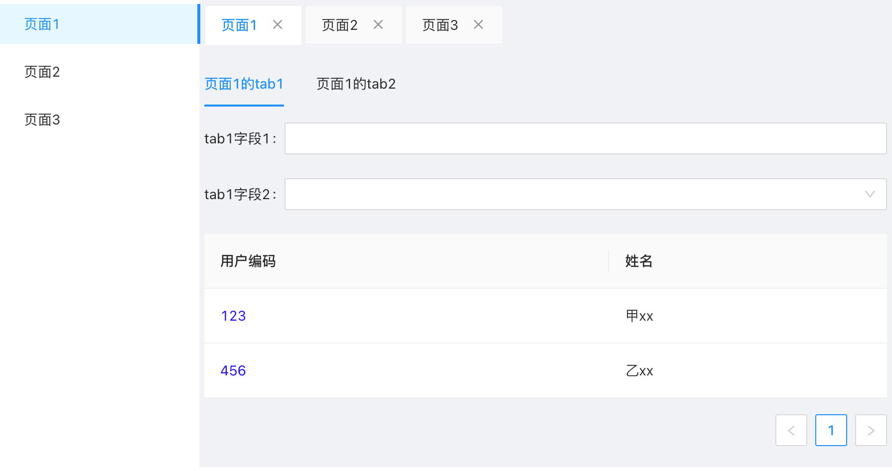

## 说明
基于react 18+，[react-router v6](https://github.com/remix-run/react-router.git)，[keepalive-for-react](https://github.com/irychen/keepalive-for-react)，antd 等的tab layout布局+页面缓存demo

通过 keepalive-for-react 做路由缓存，切换页面路由（tab）时，表单不清空，页面不会触发二次useEffect({}, [])

## 下载依赖
`npm i`

## 启动项目
`npm run start`

## demo
[预览](https://chenqiuling.github.io/tabLayout-keepAlive-demo)
